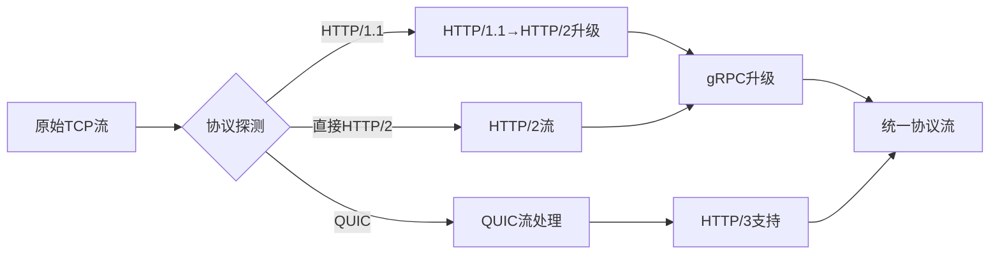
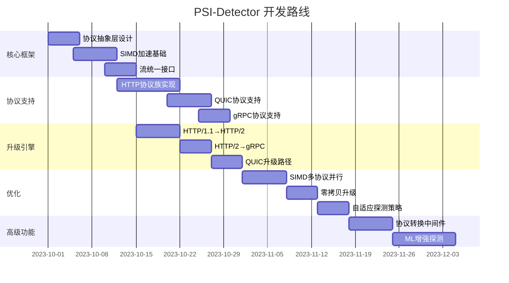

# PSI-Detector: 协议探测与升级框架

## 项目命名与概念设计

### 项目名称：`psi_detector` (符合 Rust 蛇形命名规范)
- **命名灵感**：尤里的心灵探测器 (PSI Detector) - 能探测隐形单位和心灵信号
- **概念映射**：
  - **协议探测**：像心灵探测器一样识别隐形协议
  - **协议升级**：类似尤里控制单位的能力，将连接"升级"为更高级协议
  - **SIMD加速**：象征心灵探测器的超强感知能力

## 架构设计目标 (Protocol Detection & Upgrade)
- **核心目标**：自动识别 h1/h2/h3/gRPC 协议
- **可复用组件**：
  - 基于 SIMD 的协议嗅探器（解析首字节判断协议）
  - 协议升级管道（如 h1→h2、h2→gRPC 的平滑转换）
  - ALPN/NPN 协商逻辑封装

## 架构设计

```
PSI-Detector
├── core/                # 核心抽象
│   ├── detector.rs      # 探测核心接口
│   ├── protocol.rs      # 协议定义
│   ├── fingerprint/     # 协议指纹库
│   └── error.rs         # 错误处理
├── simd/                # SIMD加速模块
│   ├── mod.rs           # SIMD抽象层
│   ├── x86_64.rs        # x86 SIMD实现
│   ├── arm_neon.rs      # ARM NEON实现
│   └── wasm_simd.rs     # WebAssembly SIMD
├── upgrade/             # 协议升级引擎
│   ├── pipeline.rs      # 升级管道
│   ├── http_to_h2.rs    # HTTP/1.1 → HTTP/2
│   ├── h2_to_grpc.rs    # HTTP/2 → gRPC
│   └── quic.rs          # QUIC升级处理
├── stream/              # 统一流处理
│   ├── mod.rs           # 流抽象
│   ├── tcp.rs           # TCP流
│   ├── quic.rs          # QUIC流
│   └── hybrid.rs        # 混合流
├── probe/               # 探测引擎
│   ├── passive.rs       # 被动探测
│   ├── active.rs        # 主动探测
│   └── heuristic.rs     # 启发式探测
└── builder.rs           # 构造器入口
```

## 核心功能模块

### 1. 协议探测核心 (`core/detector.rs`)
```rust
pub trait ProtocolDetector {
    /// 探测协议类型
    fn detect(&self, data: &[u8]) -> Result<ProtocolType, DetectorError>;
    
    /// 获取协议特征置信度
    fn confidence(&self, data: &[u8]) -> f32;
    
    /// 最小探测数据要求
    fn min_probe_size(&self) -> usize;
}

/// 协议类型枚举
pub enum ProtocolType {
    HTTP1,
    HTTP2,
    GRPC,
    WebSocket,
    QUIC,
    MQTT,
    // ...其他协议
    Unknown,
}
```

### 2. SIMD加速层 (`simd/`)
```rust
// SIMD抽象接口
pub trait SimdDetector {
    fn detect_http2(&self, data: &[u8]) -> DetectionResult;
    fn detect_quic(&self, data: &[u8]) -> DetectionResult;
    // ...其他协议
}

// 平台特定实现
#[cfg(target_arch = "x86_64")]
impl SimdDetector for X86_64Detector {
    fn detect_http2(&self, data: &[u8]) -> DetectionResult {
        // 使用AVX2/AVX512指令加速
        unsafe { x86_http2_detect(data) }
    }
}
```

### 3. 协议升级引擎 (`upgrade/`)
```rust
pub struct UpgradePipeline {
    stages: Vec<Box<dyn UpgradeStage>>,
}

impl UpgradePipeline {
    pub fn new() -> Self {
        Self { stages: Vec::new() }
    }
    
    pub fn add_stage(&mut self, stage: impl UpgradeStage + 'static) {
        self.stages.push(Box::new(stage));
    }
    
    pub async fn upgrade(&self, stream: impl AsyncRead + AsyncWrite) -> Result<UpgradedStream> {
        let mut current_stream = stream;
        for stage in &self.stages {
            current_stream = stage.upgrade(current_stream).await?;
        }
        Ok(current_stream)
    }
}

// HTTP/1.1 → HTTP/2升级实现
pub struct Http1ToH2Upgrader;

impl UpgradeStage for Http1ToH2Upgrader {
    async fn upgrade(&self, stream: TcpStream) -> Result<Http2Stream> {
        // 实现协议升级逻辑
    }
}
```

### 4. 统一流抽象 (`stream/`)
```rust
pub enum UnifiedStream {
    Tcp(TcpStream),
    Quic(QuicStream),
    Hybrid(HybridStream),
}

impl AsyncRead for UnifiedStream {
    // 统一读取接口
}

impl AsyncWrite for UnifiedStream {
    // 统一写入接口
}
```

## 特性开关设计 (Cargo.toml)

```toml
[features]
default = ["basic", "simd-accel"]

# 基础协议支持
basic = ["http", "tcp"]
http = []          # HTTP/1.1和HTTP/2
grpc = ["http2"]   # gRPC支持
websocket = []     # WebSocket支持
quic = []          # QUIC支持
mqtt = []          # MQTT支持

# 加速功能
simd-accel = ["detector/simd"] # SIMD加速探测
zero-copy = []                 # 零拷贝升级

# 运行时支持
runtime-tokio = ["tokio"]      # 使用Tokio运行时
runtime-async-std = ["async-std"] # 使用async-std运行时

# 高级功能
heuristic-detection = []       # 启发式探测
active-probing = []            # 主动探测能力
```

## 核心工作流程

### 协议探测与升级流程
```
1. 接收原始字节流
2. 使用SIMD加速的指纹匹配进行初始探测
3. 如果置信度不足，启动启发式探测或主动探测
4. 确定协议类型后，选择对应的升级管道
5. 执行协议升级转换
6. 返回升级后的高级协议流
```

### 混合协议支持场景


## 优化设计

### 1. 增量探测技术
- 支持分批次数据探测
- 动态调整探测深度
- 低置信度时请求更多数据

```rust
impl ProtocolDetector for SmartDetector {
    fn detect(&self, data: &[u8]) -> Result<ProtocolType, DetectorError> {
        if data.len() < self.min_probe_size() {
            return Err(DetectorError::NeedMoreData(self.min_probe_size()));
        }
        
        let confidence = self.confidence(data);
        if confidence > HIGH_CONFIDENCE_THRESHOLD {
            return self.final_detection(data);
        }
        
        // 低置信度时使用启发式方法
        if self.heuristics_enabled() {
            self.heuristic_detection(data)
        } else {
            self.final_detection(data)
        }
    }
}
```

### 2. SIMD 多协议并行探测
```rust
// 使用SIMD同时检测多个协议指纹
fn simd_multi_detect(data: &[u8]) -> Vec<ProtocolConfidence> {
    let mut results = Vec::new();
    
    // 并行检查HTTP/2, QUIC, gRPC等协议
    results.push(("http2", simd_detect_http2(data)));
    results.push(("quic", simd_detect_quic(data)));
    results.push(("grpc", simd_detect_grpc(data)));
    
    // 返回置信度排序的结果
    results.sort_by(|a, b| b.1.partial_cmp(&a.1).unwrap());
    results
}
```

### 3. 零拷贝协议升级
```rust
impl UpgradeStage for ZeroCopyUpgrader {
    async fn upgrade(&self, stream: TcpStream) -> Result<Http2Stream> {
        // 重用现有缓冲区
        let (read_half, write_half) = stream.into_split();
        
        // 直接转换而不复制数据
        let upgraded = Http2Stream::from_parts(
            read_half.into_zero_copy_reader(),
            write_half.into_zero_copy_writer()
        );
        
        Ok(upgraded)
    }
}
```

### 4. 协议升级管道缓存
```rust
struct UpgradePipelineCache {
    pipelines: HashMap<ProtocolType, Arc<UpgradePipeline>>,
}

impl UpgradePipelineCache {
    fn get(&mut self, protocol: ProtocolType) -> Arc<UpgradePipeline> {
        self.pipelines.entry(protocol)
            .or_insert_with(|| build_pipeline_for(protocol))
            .clone()
    }
}

// 预构建常用管道
fn build_pipeline_for(protocol: ProtocolType) -> Arc<UpgradePipeline> {
    match protocol {
        ProtocolType::HTTP1 => build_http_upgrade_pipeline(),
        ProtocolType::QUIC => build_quic_pipeline(),
        // ...
    }
}
```

## 高级功能

### 1. 自适应探测策略
```rust
enum DetectionStrategy {
    Aggressive,    // 快速但可能不准确
    Conservative,  // 准确但较慢
    Adaptive,      // 根据网络状况调整
}

impl SmartDetector {
    fn adjust_strategy(&mut self, network_conditions: NetworkMetrics) {
        match network_conditions {
            high_latency => self.strategy = DetectionStrategy::Aggressive,
            low_bandwidth => self.strategy = DetectionStrategy::Conservative,
            _ => self.strategy = DetectionStrategy::Adaptive,
        }
    }
}
```

### 2. 协议转换中间件
```rust
pub struct ProtocolAdapter {
    from: ProtocolType,
    to: ProtocolType,
    converter: Box<dyn ProtocolConverter>,
}

impl ProtocolAdapter {
    async fn convert(&self, stream: impl AsyncRead + AsyncWrite) -> Result<ConvertedStream> {
        // 实现协议间转换逻辑
    }
}

// 示例：HTTP/1.1 → HTTP/2转换器
struct Http1ToHttp2Converter;

impl ProtocolConverter for Http1ToHttp2Converter {
    fn convert(&self, data: &[u8]) -> Vec<u8> {
        // 转换协议格式
    }
}
```

### 3. 机器学习增强探测
```rust
#[cfg(feature = "ml-detection")]
struct MLDetector {
    model: ProtocolDetectionModel,
}

#[cfg(feature = "ml-detection")]
impl ProtocolDetector for MLDetector {
    fn detect(&self, data: &[u8]) -> Result<ProtocolType, DetectorError> {
        let features = extract_features(data);
        let prediction = self.model.predict(features);
        map_prediction_to_protocol(prediction)
    }
}
```

## 性能优化点

1. **SIMD指令优化**：
   - 使用平台特定的SIMD指令集
   - 多协议指纹并行匹配
   - 对齐内存访问模式

2. **零拷贝升级**：
   - 重用现有缓冲区
   - 避免协议转换时的数据复制
   - 内存映射技术

3. **管道缓存**：
   - 预构建常用升级管道
   - 惰性初始化
   - 缓存复用

4. **资源感知**：
   - 根据系统负载调整探测策略
   - 背压传播
   - 动态资源分配

## 尤里主题集成

```rust
// 红警尤里主题的协议类型别名
#[cfg(feature = "redalert-theme")]
pub mod yuri {
    pub type MindScan = ProtocolType;
    pub type PsychicUpgrade = UpgradePipeline;
    
    pub fn psychic_detection() -> impl ProtocolDetector {
        SmartDetector::new()
    }
}

// 使用示例
use psi_detector::yuri::{MindScan, PsychicUpgrade};

let detector = yuri::psychic_detection();
let protocol = detector.detect(data)?;
```

## 实施路线图



## 使用示例

### 基本协议探测
```rust
use psi_detector::{DetectorBuilder, ProtocolType};

let detector = DetectorBuilder::new()
    .enable_http()
    .enable_quic()
    .build();

match detector.detect(&data) {
    Ok(ProtocolType::HTTP2) => println!("Detected HTTP/2"),
    Ok(ProtocolType::QUIC) => println!("Detected QUIC"),
    _ => println!("Unknown protocol"),
}
```

### 协议升级管道
```rust
use psi_detector::{UpgradePipeline, TcpStream};

let pipeline = UpgradePipeline::default_http();
let upgraded_stream = pipeline.upgrade(tcp_stream).await?;

// 现在可以使用HTTP/2流
http2_serve(upgraded_stream).await;
```

### 混合协议支持
```rust
let mut detector = SmartDetector::new();
detector.enable_heuristic_detection();

let protocol = detector.detect(&initial_data)?;

let pipeline = match protocol {
    ProtocolType::HTTP1 => UpgradePipeline::http1_to_h2(),
    ProtocolType::QUIC => UpgradePipeline::quic_to_h3(),
    _ => UpgradePipeline::identity(), // 无升级
};

let upgraded_stream = pipeline.upgrade(stream).await?;
```

## 总结

`psi_detector` 是一个受红警尤里心灵探测器启发的协议探测与升级框架，具有以下特点：

1. **高效探测**：SIMD加速的多协议并行探测
2. **无缝升级**：零拷贝协议升级管道
3. **统一抽象**：跨协议的统一流接口
4. **智能适应**：自适应探测策略
5. **可扩展架构**：支持自定义协议和升级器

通过精心设计的特性开关和模块化架构，该库可以：
- 在资源受限环境中作为轻量级探测器
- 在高性能场景启用所有优化
- 支持从嵌入式系统到云原生应用的各种用例

注意：机器学习增强探测现阶段不做实现