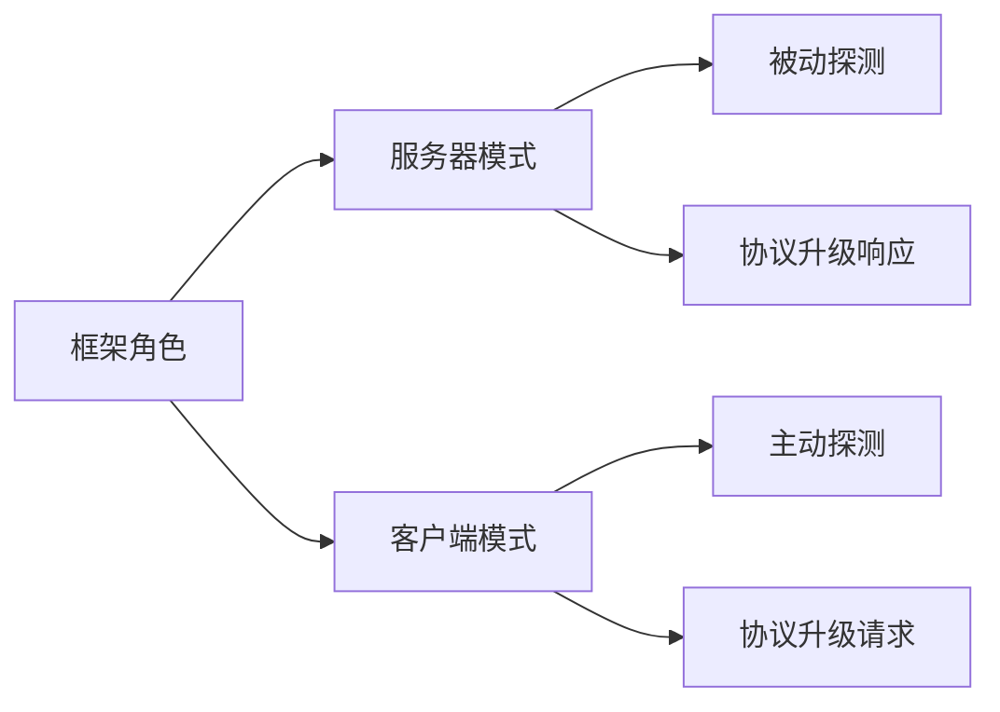

**协议探测与升级框架（psi_detector）** 是一个**双向框架**，同时支持服务器端和客户端两种工作模式。让我为您详细澄清这个设计：

---

### 框架的双重角色设计



#### 1. 服务器模式（被动式）
- **探测方式**：分析接收到的初始数据包
- **典型场景**：
  - 识别客户端使用的协议版本
  - 响应客户端的升级请求
- **工作流程**：
  ```mermaid
  sequenceDiagram
      客户端->>+服务器： 发送初始请求（可能含Upgrade头）
      服务器->>+框架： 调用detect(data)
      框架-->>-服务器： 返回协议类型+升级能力
      服务器->>框架： 执行upgrade(transport)
      框架->>客户端： 发送升级响应
      客户端->>服务器： 开始新协议通信
  ```

#### 2. 客户端模式（主动式）
- **探测方式**：根据配置主动选择协议
- **典型场景**：
  - 连接时直接使用最高效协议
  - 遇到不支持协议时自动降级
- **工作流程**：
  ```mermaid
  sequenceDiagram
      客户端->>+框架： 创建连接请求
      框架->>+目标服务器： 发送优化协议请求（如HTTP/2）
      目标服务器-->>-框架： 返回不支持（如仅HTTP/1.1）
      框架->>框架： 自动降级协议
      框架->>目标服务器： 发送HTTP/1.1请求
      目标服务器-->>-客户端： 返回响应
  ```

---

### 关键技术实现

#### 统一接口设计
```rust
// 既适用于客户端也适用于服务端
trait ProtocolAgent {
    // 探测方法（被动）
    fn detect(&self, data: &[u8]) -> Protocol;
    
    // 升级方法（主动/被动）
    async fn upgrade(
        &self, 
        transport: impl Transport,
        role: Role // 明确当前是客户端还是服务端
    ) -> Result<impl Transport>;
}

// 角色标识
enum Role {
    Client,
    Server,
}
```

#### 智能降级策略（客户端）
```rust
impl ProtocolAgent {
    fn negotiate_protocol(&self, max_supported: Protocol) -> Protocol {
        // 尝试从高到低协商协议
        let candidates = [
            Protocol::HTTP3,
            Protocol::HTTP2,
            Protocol::HTTP1_1,
        ];
        
        for proto in candidates {
            if proto <= max_supported {
                return proto;
            }
        }
        Protocol::HTTP1_1 // 保底
    }
}
```

#### 服务器升级响应器
```rust
struct ServerUpgrader {
    supported: Vec<Protocol>,
}

impl ServerUpgrader {
    async fn handle_request(
        &self, 
        request: Request
    ) -> Result<Response> {
        // 检查客户端升级请求是否在支持列表中
        if let Some(upgrade_req) = request.upgrade_request() {
            if self.supports(upgrade_req.protocol) {
                return prepare_upgrade_response(upgrade_req);
            }
        }
        
        // 否则返回普通响应
        handle_normal_request(request)
    }
}
```

---

### 在您的架构中的具体应用

#### 服务器端使用场景
```rust
async fn server_handler(socket: TcpStream) {
    // 创建传输层抽象
    let mut transport = mammoth_transport::wrap(socket);
    
    // 初始化协议框架（服务器角色）
    let mut agent = psi_detector::Agent::new(Role::Server);
    
    // 接收初始数据并探测
    let init_data = transport.peek(1024).await?;
    let detected = agent.detect(&init_data);
    
    // 根据结果处理
    if detected.requires_upgrade() {
        // 执行升级（作为服务端响应升级）
        transport = agent.upgrade(transport, Role::Server).await?;
    }
    
    // 用升级后的连接处理业务
    process_request(transport).await;
}
```

#### 客户端使用场景
```rust
async fn client_connect(addr: &str) {
    // 创建基础传输层
    let transport = mammoth_transport::connect(addr).await?;
    
    // 初始化协议框架（客户端角色）
    let mut agent = psi_detector::Agent::new(Role::Client);
    
    // 主动选择最优协议并尝试升级
    let upgraded = agent.upgrade(transport, Role::Client).await?;
    
    // 使用升级后的连接通信
    send_request(upgraded).await;
}
```

---

### 协议升级流程对比

#### 服务器端升级流程
```mermaid
sequenceDiagram
    客户端->>服务器： GET / HTTP/1.1
    客户端->>服务器： Upgrade: h2c
    服务器->>框架： detect(data)
    框架->>服务器： 检测到可升级到h2c
    服务器->>框架： upgrade(transport)
    框架->>客户端： HTTP/1.1 101 Switching Protocols
    客户端->>服务器： HTTP/2连接前奏
    服务器->>框架： 完成内部协议转换
```

#### 客户端升级流程
```mermaid
sequenceDiagram
    客户端->>框架： 请求连接
    框架->>服务器： HTTP/2连接前奏
    服务器->>框架： 不支持HTTP/2的错误
    框架->>框架： 降级标记
    框架->>服务器： HTTP/1.1请求
    服务器->>框架： HTTP/1.1响应
```

---

### 性能优化设计

#### 双模式共享核心
| 组件                | 服务器模式                  | 客户端模式                  |
|---------------------|---------------------------|---------------------------|
| **协议探测引擎**     | 基于数据包分析              | 基于服务端能力公告          |
| **升级处理器**       | 响应式处理器                | 主动式发起者               |
| **SIMD加速**        | 用于头部快速扫描            | 用于协议特征快速匹配        |
| **缓存系统**        | 会话级协议缓存              | 服务端能力缓存             |

#### 零成本抽象保障
```rust
// 通过条件编译实现模式专有优化
#[cfg(feature = "server-mode")]
impl ProtocolAgent {
    fn server_specific_optimization(&self) { ... }
}

#[cfg(feature = "client-mode")]
impl ProtocolAgent {
    fn client_specific_optimization(&self) { ... }
}
```

---

### 总结

您理解完全正确：`psi_detector` 协议探测与升级框架是一个**双向框架**：
1. **服务器模式**：被动探测传入连接，响应升级请求
2. **客户端模式**：主动探测服务端能力，发起升级请求

这种双重角色设计带来关键优势：
- **架构对称**：客户端与服务端使用同一技术栈
- **行为一致**：保证协议处理的兼容性
- **资源共享**：核心算法（如HPACK）可复用
- **部署灵活**：相同库文件可用于客户端SDK或服务器程序

在您的Web/gRPC服务器架构中：
- **负载均衡器**：运行在服务器模式，分流请求
- **业务服务**：运行在服务器模式，处理升级
- **客户端SDK**：运行在客户端模式，主动升级

这种设计完美契合分层架构需求，同时确保协议处理的最高性能和最大兼容性。